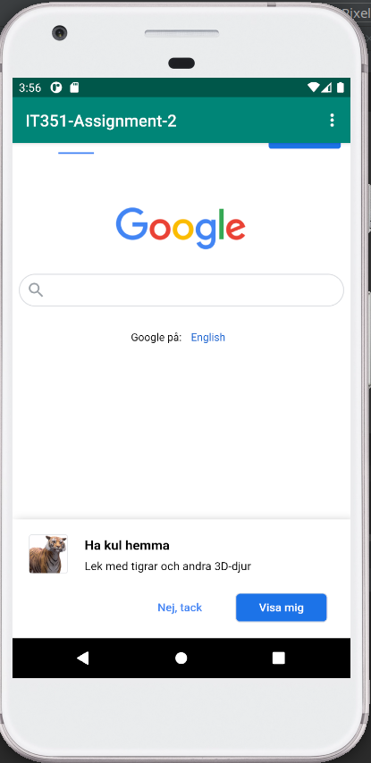
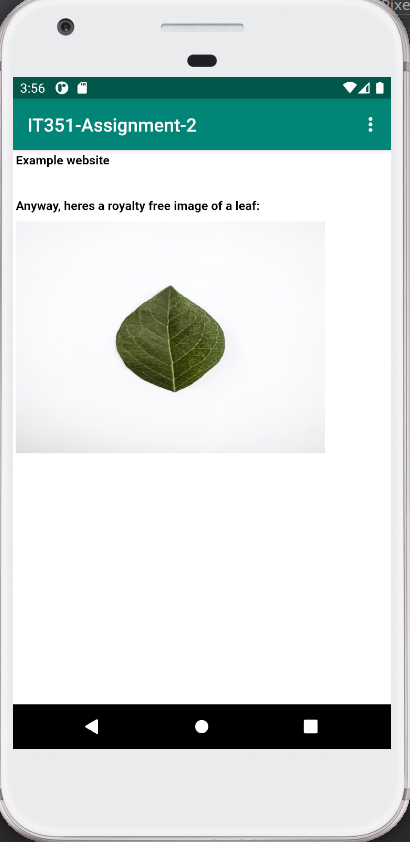

# Rapport IT351 - Assignment 2
## Rename app
To rename the app the string declaration in ```res/values/strings.xml``` is changed. This allows us to change the contents of the string everywhere it's referenced, making it easier to fully replace it in the app.
This is done by changing the line ```<string name="app_name">string here</string>``` in strings.xml, replacing string here with the desired app name.
```xml
<resources>
    <string name="app_name">IT351-Assignment-2</string>
    <string name="action_external_web">External Web Page</string>
    <string name="action_internal_web">Internal Web Page</string>
    <string name="bla">Bla</string>
</resources>
```
## Enable internet access
Due to how android apps are sandboxed we have to explicitly tell the os that the app needs the internet resource or it won't be given access to it.  
These permissions are defined in the ```AndroidManifest.xml``` file, for the app to request internet access we simply have to add the line ```<uses-permission android:name="android.permission.INTERNET" />``` to manifest file.
```xml
<?xml version="1.0" encoding="utf-8"?>
<manifest xmlns:android="http://schemas.android.com/apk/res/android"
    package="com.example.webviewapp">

    <application
        android:allowBackup="true"
        android:icon="@mipmap/ic_launcher"
        android:label="@string/app_name"
        android:roundIcon="@mipmap/ic_launcher_round"
        android:supportsRtl="true"
        android:theme="@style/AppTheme">
        <activity
            android:name=".MainActivity"
            android:label="@string/app_name"
            android:theme="@style/AppTheme.NoActionBar">
            <intent-filter>
                <action android:name="android.intent.action.MAIN" />

                <category android:name="android.intent.category.LAUNCHER" />
            </intent-filter>
        </activity>
    </application>
    <uses-permission android:name="android.permission.INTERNET" />

</manifest>
```
## Webview
### Creating the webview
The current main content view consists of a text view, this is declared
in the ```content_main.xml``` which defines the main view of the app. We
can change the text view to a web view by simply changing the text view
declaration to a webview one. I also changed some dimension settings to
account for the toolbar at the top to prevent them overlapping.
```xml
<WebView android:id="@+id/my_webview"
android:layout_marginTop="?attr/actionBarSize"
android:layout_width="match_parent" android:layout_height="match_parent"
app:layout_constraintBottom_toBottomOf="parent"
app:layout_constraintLeft_toLeftOf="parent"
app:layout_constraintRight_toRightOf="parent"
app:layout_constraintTop_toTopOf="parent" />```
```
Most of the layout definitions match their parent, which means they'll
fill the entire screen and a margin is added to the top which is set to
match the size of the toolbar. As can be seen at the first line we also
assign the webview an id here, this will be used to create a java object
that references the webview in the program logic.

### Manipulating the webview
The app logic is handled in the MainActivity.java file which is written
in java. First we declare a memeber variable of the webview type to
store the reference to the webview once the program fetches it.

```java
private WebView myWebView;
```
This variable needs to be set once the webview is created, which is done
when the app is created, so we can use the ```onCreate``` function to do
this. After the webview variable has been created we'll configure some
elements of it as well
```java
        myWebView = (WebView) findViewById(R.id.my_webview);
        myWebView.getSettings().setJavaScriptEnabled(true);
        myWebView.getSettings().setLoadWithOverviewMode(true);
        myWebView.getSettings().setUseWideViewPort(true);
        myWebView.loadUrl("https://www.google.se/");
```
Here the webview is found by using the id we assigned earlier, the
returned reference is stored in the variable. We then use it to
configure things such as wether or not javascript is enabled in the
webview, the initial zoom level of the webview and how the viewport is
handled. Finally ```loadUrl()``` is called to display an initial website
when the app is opened.

## Internal html
The next step is to add a custom html page to the app. First an assets
folder is added to the app folder where a new html file is created. I
just threw together a basic html website as a proof of concept, below is
what i created.
```html
<h1>Example website</h1>
<h1>&nbsp;</h1>
<h1>Anyway, heres a royalty free image of a leaf:</h1>
<p></p>
```
## Show webpage functions
Finally the show webpage functions needs to be implemented, these simply
need to tell the webview to load a certain url. Since the webview object
has a built in function for this the solution is simple.
```java
    public void showExternalWebPage(){
        myWebView.loadUrl("https://www.google.se/");
    }

    public void showInternalWebPage(){
        myWebView.loadUrl("file:///android_asset/example.html");
    }
```
The memeber variable used here which will contain the webview we fetched
from the app earlier. The external web page is easy enough, since it
simply has to pass the standard url for whichever website you would
like. The internal website needs specific syntax which tells webview
that you're looking for a local file instead.

## Implement toolbar actions
To call these functions when menu items are clicked we need to call them
in the ```onOptionsItemSelected``` function. This function is called
when a menu item is clicked and gets the item clicked passed to it as a
parameter, so we can use this parameter to decide how to handle the
click. If the id of the item matches the external web item we want to
open the external web page, if it matches the internal web item we want
to open the internal web page. This is achived with this code:
```java
    @Override
    public boolean onOptionsItemSelected(MenuItem item) {
        // Handle action bar item clicks here. The action bar will
        // automatically handle clicks on the Home/Up button, so long
        // as you specify a parent activity in AndroidManifest.xml.
        int id = item.getItemId();

        //noinspection SimplifiableIfStatement
        if (id == R.id.action_external_web) {
            showExternalWebPage();
            return true;
        }

        if (id == R.id.action_internal_web) {
            showInternalWebPage();
            return true;
        }

        return super.onOptionsItemSelected(item);
    }
```
## Results
Below are both the external (google.se) and the internal html page
displayed by the webview in the app.  


